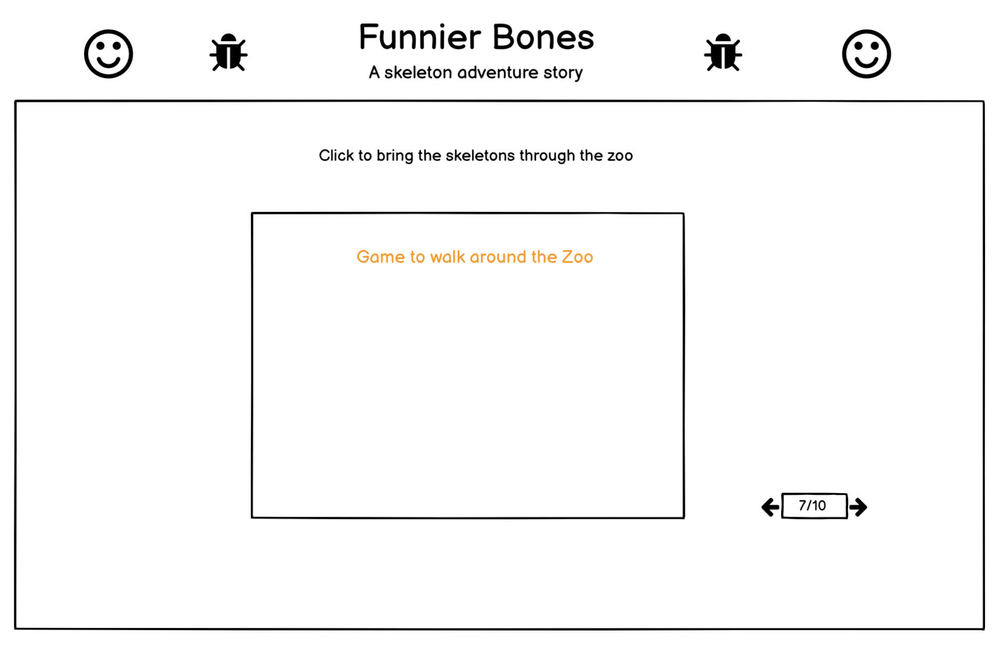

# Funnier Bones

[Link to Live Project](https://nlenno1.github.io/funnier_bones/)

***
# Introduction
Join the Funnybones skeletons in their fun and spooky adventures around the town!
A new interactive take on the modern classic children's story - Funnybones.

This project was built as part of Code Institutes Halloween 'Spookathon' Hackathon event, October 2021.
# Development Planes

### Project Goals
* To present a new look and experience to the children's book Funnybones.
* To create interactive elements appropriate to the storyline.
### User Demographic
This website is aimed at very young children and parents of young children.
### User Stories
* As a parent I would like to be able to read a story with my child that includes animation and games.

* As an avid Funnybones fan I would like to experience the story with a new look and interaction. 
## Scope 

## **Wireframes**

Pages 1,2,4,5,8,9,10 - Background image with story text

Page 3 - Help get the skeleton get to the door

Page 6 - Put the dog back together

Page 7 - Bring the skeletons throught the zoo

### Design

**Colour Scheme**
* The colors used are those associated with halloween.
* #703c14, #a14907 and #401d03 for orange hues on pumpkins.
* Black and white colors used for text and backgrounds.

**Typography**
* The Bubblegum Sans", fantasy font was used for the story text.
* Montserrat', Arial, sans-serif for main body text.
* ZCOOL KuaiLe', sans-serif for main title text.

# Features
* The complete Funnybones storyline.

* Images and animation to accompany the storyline.

* Simple interactive games for fun.

## Games
The website includes four games:

1. Get out of the house 2D platform game.

2. Put the dog back together puzzle game.

3. Run around the zoo 2D topdown game.

4. Get home 2D jumping game

# Technologies Used

- HTML5 - Programming Language
- CSS3 - Programming Language
- JavaScript - Programming Language
- [jQuery](https://jquery.com/) - JavaScript Library
- [Bootstrap](https://getbootstrap.com/) - Library Import
- [Google Fonts](https://fonts.google.com/) - Typography Import
- [Git Pod](https://gitpod.io/) - IDE (Integrated Development Environment)
- [Git](https://git-scm.com/) - Version Control Tool
- [Github](https://github.com/) - Cloud based hosting service to manager my Git Repositories
- [Code Institute GitPod Template](https://github.com/Code-Institute-Org/gitpod-full-template) - Provides GitPod extensions to help with code production
- [Google Chrome Development Tools](https://developer.chrome.com/docs/devtools/) - Development Tools
- [Tiny JPG](https://tinyjpg.com/) - JPG and PNG Image Compressor
- [Balsamiq](https://www.https://balsamiq.com//) - Wireframe designer software
- [HTML Formatter](https://www.freeformatter.com/html-formatter.html#ad-output) - Formatting HTML Code
- [CSS Beautifier](https://www.freeformatter.com/css-beautifier.html) - Beautifying CSS Code
- [JavaScript Validator](https://beautifytools.com/javascript-validator.php) - Validating JS code
- [Font Awesome](https://fontawesome.com/) - Icon provider
= [Lighthouse](https://developers.google.com/web/tools/lighthouse) - Webpage testing

# Testing

Lighthouse Testing

Automatic testing was done using [Selenium IDE](https://www.selenium.dev/selenium-ide/): [funnier-bones-test](assets/testing/funnier-bones.side)
To open this file:
- Download the file
- Go to [Selenium IDE](https://www.selenium.dev/selenium-ide/)
- Download the add-on for the browser you're currently using (e.g. if you're using Google Chrome, click on "CHROME DOWNLOAD")
- Open the add-on
- Click on Open Project
- Click on Run all tests
- In the Log section you will see "'funnier-bones-test-1' completed successfully"

# Deployment

All the code was written using [Gitpod](https://www.gitpod.io/), an online IDE, and then pushed to a repository which was stored on a [Gitpod account](https://github.com/nlenno1/).

This project is deployed on GitHub Pages. 
This is the process used to deploy the project:

1. In the Github Repository I selected the settings tab and scrolled down to the GitHub Pages section.
2. In the source section, for the branch drop down menu, I selected "Main" and then clicked the save button.
3. Once this process had been completed the website URL was displayed above the GitHub Pages section.

This code can be cloned or forked from the [GitHub repository](https://github.com/nlenno1/funnier_bones).

## Forking the Repository
When you fork the repository you create a copy of the original repository on your own GitHub account to view and edit without effect the original.
To Fork something you need to:

1. Log into your GitHub account or create one.
2. Open the [repository](https://github.com/nlenno1/funnier_bones).
3. Click the "Fork" button which is located on the right-hand side of the screen just below your user icon.
4. The fork should load and save to your GitHub account.

## Cloning the Repository using GitPod
To clone the repository, you first need to:

1. Install the GitPod Browser Extension for Chrome (including restarting the browser).
2. Log into your GitHub or create an account.
3. Find the GitHub Repository that you want to clone.
4. Click the green "GitPod" button in the top right corner of the repository. This will trigger a new GitPod workspace to be created.

## Cloning the Repository using Git

1. Open the [repository](https://github.com/nlenno1/funnier_bones), click the  code button, which is located on the right above all the repository file names.
2. Select HTTPS and copy the clone URL.
3. In your command line type "git clone" and then paste the URL that you just copied.
4. Press enter to create your local clone

# Credits

## Content
* Funnybones was created by Janet Ahlberg and Allan Ahlberg, and written by Jocelyn Stevenson.

* Spider animation was a modified version of this [CodePen](https://codepen.io/SofiaSergio/pen/geGqBa)
Pumpkin CSS was modified version of the one found in this [tutorial](https://thecodeplayer.com/walkthrough/pure-css-pumpkin)

* Zoo game code is a modified version and mix of code from https://codepen.io/luismsf/pen/gEKku and https://codepen.io/punkydrewster713/pen/WNrXPrb
Game music is "A friendly ghost" by Arthur Benson from open source music website https://www.epidemicsound.com/

* [Chrome Dinosaur Tutorial](https://www.youtube.com/watch?v=i7nIutSLvdU&ab_channel=Keepcoding) was used to build the get out the house game
* [Build Flappy Bird and Doodle jump tutorial](https://www.youtube.com/watch?v=8xPsg6yv7TU&ab_channel=freeCodeCamp.org) was used to build the run home game.

* [Slider revolution](https://www.sliderrevolution.com/resources/css-text-animation/) code was used for guidance on how to use giff images as backgrounds. 
* [W3 schools](https://www.w3schools.com/) for assistance with text box animations.
* [Stack Over Flow](https://stackoverflow.com/) was used for general troubleshooting.
* [Photopea](https://www.photopea.com/) was used to edit the skeleton dog image for the second game.
* [Selenium IDE](https://www.selenium.dev/selenium-ide/) for testing

## Media 

* [Clipart Library](http://clipart-library.com/) was used for background images and for the [skeleton dog](http://clipart-library.com/clipart/n740427.htm) of the second game
* Pixabay [hounted house](https://pixabay.com/illustrations/halloween-haunted-house-horror-836849/) and [twilight light night](https://pixabay.com/vectors/landscape-twilight-light-night-1844231/) was used for background images
* [Giphy](https://giphy.com/gifs/lightning-strike-CKlafeh1NAxz35KTq4) was used for the giff image behind the text.
* [Illustoon](https://illustoon.com/) images were used to create the Hackathon App image and in some of the games

## Acknowledgments

Thanks to our Facilitator Naoise Gaffney for all his help and guidance through building this project!

